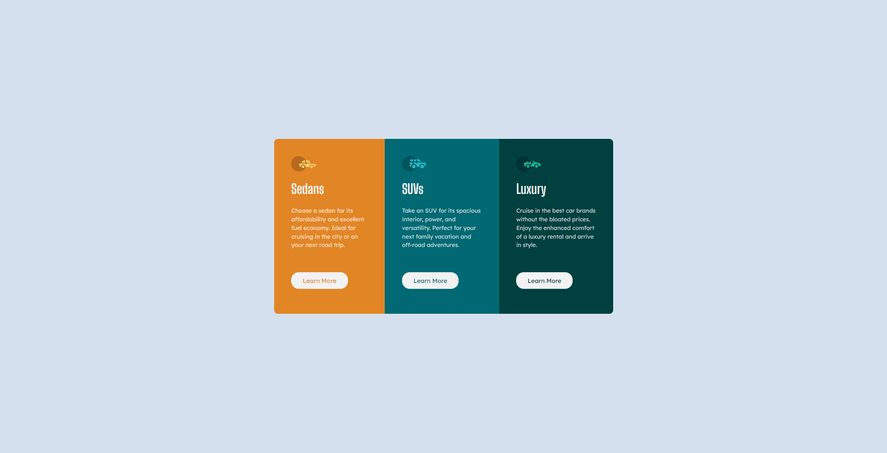
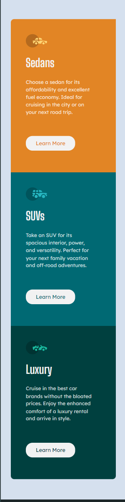

# Frontend Mentor - 3-column preview card component solution

This is a solution to the [3-column preview card component challenge on Frontend Mentor](https://www.frontendmentor.io/challenges/3column-preview-card-component-pH92eAR2-). Frontend Mentor challenges help you improve your coding skills by building realistic projects. 

## Table of contents

- [Overview](#overview)
  - [The challenge](#the-challenge)
  - [Screenshot](#screenshot)
  - [Links](#links)
- [My process](#my-process)
  - [Built with](#built-with)
  - [What I learned](#what-i-learned)
  - [Useful resources](#useful-resources)
- [Author](#author)

## Overview

### The challenge

Users should be able to:

- View the optimal layout depending on their device's screen size
- See hover states for interactive elements

### Screenshot

 If you prefer not to add a screenshot, feel free to remove this entire section.**

### Links

- Solution URL: [Add solution URL here](https://your-solution-url.com)
- Live Site URL: [Add live site URL here](https://your-live-site-url.com)

## My process

### Built with

- Semantic HTML5 markup
- CSS custom properties
- Flexbox

### What I learned

This challenge has helped me learn how to work with mobile devices.

If you want more help with writing markdown, we'd recommend checking out [The Markdown Guide](https://www.markdownguide.org/) to learn more.

### Useful resources
- [CodeCademy Cheatsheet](https://www.codecademy.com/resources/cheatsheets/language/html-css) - This cheatsheat can help you remember things you might have forgot. We are humans, we forget stuff.

## Author
- Frontend Mentor - [@tedkataa](https://www.frontendmentor.io/profile/tedkataa)
- Twitter - [@tedkataa_](https://x.com/tedkataa_)
